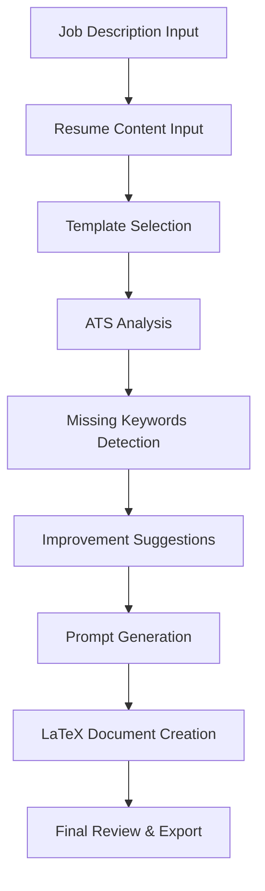

# Prompter - Resume & Cover Letter Assistant

A comprehensive web application that helps users create optimized resume and cover letter prompts for AI assistants, with advanced ATS (Applicant Tracking System) analysis capabilities and intelligent suggestions.

## 🎯 Goal

Prompter aims to bridge the gap between job seekers and AI-powered resume optimization by:

- **Simplifying AI Prompt Creation**: Generate precise, effective prompts for AI assistants to tailor resumes and cover letters
- **ATS Optimization**: Analyze and improve resume compatibility with Applicant Tracking Systems
- **Professional Document Generation**: Convert AI-generated content into professional LaTeX-formatted documents
- **Template Management**: Provide reusable templates for consistent, high-quality applications
- **Data-Driven Insights**: Offer actionable feedback based on job description analysis

## ✨ Key Features

### 🎨 Core Functionality
- **Resume Prompt Generation**: Create tailored prompts for AI assistants to optimize resumes
- **Cover Letter Assistance**: Generate cover letter prompts with LaTeX output capability
- **Template Library**: Save and manage multiple resume and cover letter templates
- **Fast Compile Mode**: One-click generation for rapid turnaround
- **Custom Prompt Templates**: Create and customize prompt templates for different use cases

### 🔍 ATS Analysis & Optimization
- **Comprehensive ATS Scoring**: Multi-dimensional analysis including keyword matching, skills alignment, and format compliance
- **Missing Keywords Detection**: Identify critical keywords from job descriptions that should be included
- **Improvement Suggestions**: Categorized, actionable recommendations for better ATS compatibility
- **Performance Tracking**: Compare original vs. tailored resume performance
- **Real-time Feedback**: Instant analysis as you make changes

### 🛠 Advanced Tools
- **LaTeX Document Generation**: Convert prompts into professional LaTeX-formatted resumes
- **AI-Powered Suggestions**: Leverage Google Gemini API for intelligent recommendations
- **Template Customization**: Edit and refine generated documents
- **Data Persistence**: Save progress and templates with Firebase integration
- **Cross-Platform Sync**: Access your data from any device with authentication

## 📋 Requirements

### Development Environment
- **Node.js**: Version 18.x or higher
- **npm**: Version 8.x or higher (or yarn equivalent)
- **Modern Browser**: Chrome, Firefox, Safari, or Edge (latest versions)

### External Services

#### Firebase Setup
1. **Firebase Project**: Create a project at [firebase.google.com](https://firebase.google.com)
2. **Authentication**: Enable Google Sign-In in Firebase Console
3. **Firestore**: Set up Firestore database for user data storage
4. **Environment Variables**: Configure the following in `.env`:

```env
VITE_FIREBASE_API_KEY=your_api_key
VITE_FIREBASE_AUTH_DOMAIN=your_project.firebaseapp.com
VITE_FIREBASE_PROJECT_ID=your_project_id
VITE_FIREBASE_STORAGE_BUCKET=your_project.appspot.com
VITE_FIREBASE_MESSAGING_SENDER_ID=your_sender_id
VITE_FIREBASE_APP_ID=your_app_id
```

#### AI Integration
- **Google Gemini API Key**: Required for ATS analysis and LaTeX generation
- **OpenRouter API Key** (Optional): For alternative AI providers

```env
VITE_GEMINI_API_KEY=your_gemini_api_key
VITE_OPENROUTER_API_KEY=your_openrouter_key (optional)
```

### System Requirements
- **RAM**: Minimum 4GB, recommended 8GB+
- **Storage**: 500MB free space for dependencies
- **Network**: Stable internet connection for AI API calls

## 🔒 Authentication & Security

### Firebase Authentication Setup
The application uses Firebase Authentication with Google Sign-In for secure user management:

#### Firebase Configuration Steps:
1. **Create Firebase Project**: Go to [Firebase Console](https://console.firebase.google.com/)
2. **Enable Authentication**: Navigate to Authentication > Sign-in method
3. **Configure Google Provider**: Enable Google sign-in provider
4. **Domain Authorization**: Add your domain to authorized domains
5. **API Keys**: Copy configuration to `.env` file

#### Security Features:
- **Persistent Sessions**: Browser-based local persistence
- **Secure Token Storage**: Firebase handles token management
- **Cross-device Sync**: Access data from multiple devices
- **Privacy Protection**: User data encrypted and secure

### Authentication Flow:
```typescript
// Web application authentication flow
signInWithGoogle() → Firebase Auth → User Session → Data Access
```

#### How It Works:
- **Popup Authentication**: Clean, secure popup-based sign-in
- **Session Persistence**: Maintains login state across browser sessions  
- **Data Synchronization**: Templates and settings sync across devices
- **Secure Logout**: Complete session cleanup on sign-out

## 🏗 Architecture

### Frontend Architecture
```
┌─────────────────────────────────────────────────────────────┐
│                     React Application                      │
├─────────────────────────────────────────────────────────────┤
│  Components Layer                                          │
│  ├── UI Components (Radix UI + Custom)                    │
│  ├── Feature Components (ATS Analysis, Generators)        │
│  ├── Layout Components (Headers, Footers, Dialogs)        │
│  └── Utility Components (Auth, Theme, Settings)           │
├─────────────────────────────────────────────────────────────┤
│  State Management                                          │
│  ├── React Hooks (useState, useEffect, useCallback)       │
│  ├── Custom Hooks (useTemplates, usePromptGenerator)      │
│  ├── Context Providers (Auth, AI Provider, Theme)         │
│  └── Local Storage + Firebase Sync                        │
├─────────────────────────────────────────────────────────────┤
│  Services Layer                                            │
│  ├── Firebase Authentication                              │
│  ├── Firestore Database                                   │
│  ├── Google Gemini AI API                                 │
│  ├── OpenRouter API (Optional)                            │
│  └── Local Storage Management                             │
└─────────────────────────────────────────────────────────────┘
```

### Component Organization
```
src/
├── components/           # Reusable UI components
│   ├── ui/              # Base UI components (Radix UI)
│   ├── ATS*.tsx         # ATS analysis components
│   ├── *Generator.tsx   # Content generation components
│   ├── Auth*.tsx        # Authentication components
│   └── Template*.tsx    # Template management components
├── hooks/               # Custom React hooks
├── lib/                 # Utility libraries and services
│   ├── firebase.ts      # Firebase configuration
│   ├── aiProviderContext.tsx  # AI service management
│   └── utils.ts         # Utility functions
├── types/               # TypeScript type definitions
└── assets/              # Static assets
```

### Data Flow
1. **User Input**: Job description, resume content, preferences
2. **Processing**: AI analysis via Google Gemini API
3. **Analysis**: ATS scoring, keyword extraction, suggestion generation
4. **Output**: Optimized prompts, LaTeX documents, actionable feedback
5. **Storage**: Templates and user data saved to Firebase/Local Storage

### Key Technologies
- **React 19**: Latest React with concurrent features
- **TypeScript**: Type-safe development
- **Vite**: Fast build tool and development server
- **Tailwind CSS**: Utility-first styling framework
- **Radix UI**: Accessible component primitives
- **Firebase**: Authentication and data persistence
- **Google Gemini AI**: Natural language processing
- **LaTeX**: Professional document formatting

## 🚀 Installation & Setup

### 1. Clone the Repository
```bash
git clone <repository-url>
cd prompter-web
```

### 2. Install Dependencies
```bash
npm install
```

### 3. Environment Configuration
Create a `.env` file in the project root:
```bash
cp .env.example .env
```

Edit `.env` with your actual values:
```env
# Firebase Configuration
VITE_FIREBASE_API_KEY=your_firebase_api_key
VITE_FIREBASE_AUTH_DOMAIN=your_project.firebaseapp.com
VITE_FIREBASE_PROJECT_ID=your_project_id
VITE_FIREBASE_STORAGE_BUCKET=your_project.appspot.com
VITE_FIREBASE_MESSAGING_SENDER_ID=your_sender_id
VITE_FIREBASE_APP_ID=your_app_id

# AI API Keys
VITE_GEMINI_API_KEY=your_gemini_api_key
VITE_OPENROUTER_API_KEY=your_openrouter_key  # Optional
```

### 4. Firebase Setup
1. Go to [Firebase Console](https://console.firebase.google.com/)
2. Create a new project or select existing one
3. Enable Authentication with Google provider
4. Set up Firestore database
5. Add your domain to authorized domains

### 5. Start Development Server
```bash
npm run dev
```
The application will be available at `http://localhost:3000`

### 6. Build for Production
```bash
npm run build
```
Built files will be in the `build/` directory.

## 📁 Project Structure

```
prompter-web/
├── 📂 public/                  # Static assets
│   ├── 📄 manifest.json       # Chrome extension manifest (legacy)
│   ├── 🖼️ icon.png           # App icon
│   └── 📸 screenshots/        # App screenshots
├── 📂 src/                    # Source code
│   ├── 📂 components/         # React components
│   │   ├── 📂 ui/            # Base UI components (Radix UI)
│   │   │   ├── button.tsx
│   │   │   ├── card.tsx
│   │   │   ├── dialog.tsx
│   │   │   └── ...
│   │   ├── 🔍 ATSInsightsTracker.tsx     # ATS performance tracking
│   │   ├── 🔍 CombinedATSAnalysis.tsx    # Unified ATS analysis
│   │   ├── ⚙️ SettingsDialog.tsx         # App settings
│   │   ├── 📝 ResumeLaTeXGenerator.tsx   # LaTeX resume generation
│   │   ├── 💼 CoverLetterGenerator.tsx   # Cover letter generation
│   │   ├── 🎨 TemplateSelector.tsx       # Template management
│   │   └── 🔐 GoogleAuthButton.tsx       # Authentication
│   ├── 📂 hooks/              # Custom React hooks
│   │   ├── useAIService.ts    # Unified AI service integration
│   │   ├── useTemplates.ts    # Template management logic
│   │   └── usePromptGenerator.ts  # Prompt generation logic
│   ├── 📂 lib/                # Utility libraries
│   │   ├── 🔥 firebase.ts     # Firebase configuration
│   │   ├── 🤖 aiProviderContext.tsx  # AI service management
│   │   ├── 🔐 authContext.tsx # Authentication context
│   │   └── 🛠️ utils.ts        # Utility functions
│   ├── 📂 types/              # TypeScript definitions
│   │   ├── index.ts           # Main type definitions
│   │   └── chrome.d.ts        # Chrome extension types (legacy)
│   ├── 📂 assets/             # Static assets
│   ├── 🎯 App.tsx             # Main application component
│   └── 🚀 main.tsx            # Application entry point
├── 📂 docs/                   # Documentation
│   ├── 📋 ats-optimization.md # ATS optimization details
│   ├── 📈 optimization-summary.md  # Performance improvements
│   ├── 🔄 retry-functionality.md   # Error handling guide
│   └── 📊 complete-enhancement-summary.md  # Full feature summary
├── 📂 build/                  # Production build output
├── ⚙️ vite.config.ts          # Vite configuration
├── 📦 package.json            # Dependencies and scripts
├── 🎨 tailwind.config.js      # Tailwind CSS configuration
├── 📝 tsconfig.json           # TypeScript configuration
└── 🌍 .env                    # Environment variables
```

### Key Files Explained

#### Core Application
- **`App.tsx`**: Main application component with routing and state management
- **`main.tsx`**: Entry point with providers and global setup

#### Component Categories
- **UI Components** (`components/ui/`): Reusable Radix UI-based components
- **Feature Components**: Specialized components for core functionality
- **Template Components**: Resume and cover letter template management
- **ATS Components**: Analysis and optimization tools

#### Business Logic
- **`hooks/`**: Custom hooks encapsulating complex logic
- **`lib/`**: Services, contexts, and utility functions
- **`types/`**: TypeScript type definitions for type safety

#### Configuration
- **`vite.config.ts`**: Build configuration with optimization settings
- **`tailwind.config.js`**: Styling framework configuration
- **`tsconfig.json`**: TypeScript compiler settings

## 🔄 How It Works

### User Workflow


### 1. Content Input Phase
- **Job Description**: User pastes the target job posting
- **Resume Content**: Upload existing resume or use template
- **Template Selection**: Choose from saved templates or create new ones

### 2. AI-Powered Analysis
- **ATS Compatibility**: Analyze resume against job requirements
- **Keyword Matching**: Identify missing critical keywords
- **Skills Assessment**: Evaluate skill alignment with job needs
- **Format Compliance**: Check ATS-friendly formatting

### 3. Intelligent Optimization
- **Suggestion Generation**: Create categorized improvement recommendations
- **Missing Keywords**: Highlight important terms to include
- **Prompt Creation**: Generate optimized prompts for AI assistants
- **Real-time Feedback**: Provide instant scoring and recommendations

### 4. Document Generation
- **LaTeX Conversion**: Transform optimized content into professional format
- **Template Application**: Apply formatting and styling
- **Quality Assurance**: Ensure document integrity and completeness

### Key Features in Action

#### Fast Compile Mode
```typescript
// One-click generation process
if (fastCompile && promptType === 'resume') {
  // Auto-select last used template
  // Generate prompt automatically
  // Create LaTeX output instantly
  // Skip manual template selection
}
```

#### ATS Analysis Engine
```typescript
interface ATSScore {
  overall: number;              // 0-100 compatibility score
  keywordMatch: number;         // Keyword density analysis
  skillsAlignment: number;      // Skills vs. requirements match
  experienceMatch: number;      // Experience level alignment
  formatCompliance: number;     // ATS-friendly formatting score
  feedback: string[];           // Specific feedback points
  missingKeywords: string[];    // Critical missing terms
  recommendations: string[];    // Actionable improvements
}
```

#### Template Management System
- **Resume Templates**: LaTeX-formatted resume structures
- **Cover Letter Templates**: Professional cover letter formats
- **Custom Prompts**: User-defined prompt templates
- **Cloud Sync**: Firebase-backed template synchronization
- **Version Control**: Track template modifications

## 🧪 Advanced Features

### ATS Optimization Engine
The application includes a sophisticated ATS analysis system that:

- **Multi-dimensional Scoring**: Evaluates resumes across 5 key metrics
- **Industry-specific Analysis**: Adapts scoring based on job field
- **Keyword Density Optimization**: Ensures optimal keyword distribution
- **Format Compliance Checking**: Validates ATS-friendly formatting
- **Competitive Analysis**: Compares against industry standards

### AI Integration Architecture
```typescript
// Modular AI provider system
interface AIProvider {
  generateContent(prompt: string): Promise<string>;
  analyzeResume(resume: string, jobDesc: string): Promise<ATSScore>;
  generateSuggestions(analysis: ATSScore): Promise<Suggestion[]>();
}

// Currently supported providers
- Google Gemini API (Primary)
- OpenRouter API (Alternative)
- Extensible for future providers
```
